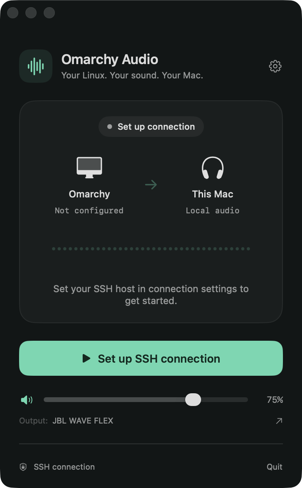
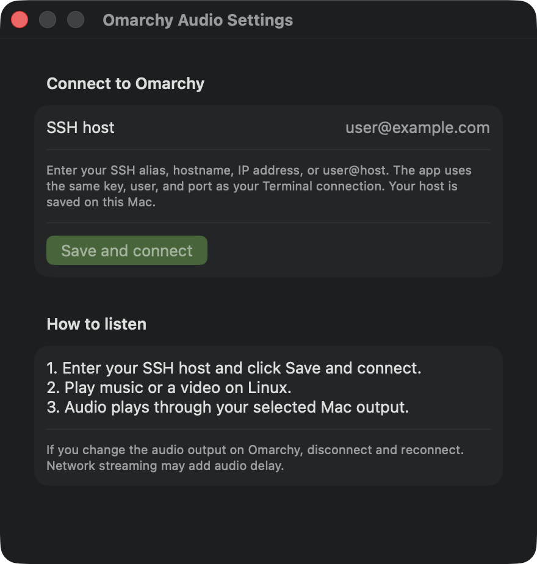

# Omarchy Audio

[](https://github.com/jadilson12/omarchy-audio/actions/workflows/ci.yml)

A native macOS app built with SwiftUI and AVFoundation that lets you listen to
Omarchy's audio on your Mac. It lives in the menu bar, like Dita, and includes a
compact window with volume controls, mute, and an incoming audio level indicator.



## Download and install

Download `Omarchy-Audio-v1.0.1-macos-arm64.zip` from the
[latest release](https://github.com/jadilson12/omarchy-audio/releases/latest).
This build requires an Apple Silicon Mac (M1 or later) running macOS 14 or later.
Extract the ZIP, then drag `Omarchy Audio.app` into Applications and open it.

The app is signed ad hoc and is not notarized. If macOS blocks it, open
**System Settings > Privacy & Security** and use **Open Anyway** after attempting
to launch it, if you trust the download.

## Launch and connect

Open `build/Omarchy Audio.app` in Finder, or run this from the project directory:

```bash
open "build/Omarchy Audio.app"
```

On first launch, click **Set up SSH connection**, enter your SSH alias, hostname,
IP address, or `user@host`, and click **Save and connect**. On subsequent launches,
click **Listen to Omarchy**, then play music or a video on Linux.
Audio plays through the output device selected in your Mac's Sound settings. The
button next to the output name opens those settings. **Disconnect**
stops remote capture; closing the window keeps the app and stream running in the
menu bar. **Quit** stops both.

There is no predefined host. Configure your own connection in the app, using the
user, port, and key already configured in macOS SSH. Use the gear button to change
the host after disconnecting. The app remembers your host and volume settings
locally on your Mac. Existing saved hosts are preserved when updating the app.
There is no need to start streaming from Terminal.



## Requirements

- macOS 14 or later; this app has been validated on macOS 26 with Apple Silicon.
- `/usr/bin/ssh` with key-based authentication already configured, without password prompts.
- On Omarchy: PipeWire/PulseAudio running, with `pactl` and `parec` available.
- To build: Xcode Command Line Tools (Swift 6). No external packages required.

Audio uses native AVAudioEngine/AVAudioSourceNode APIs, with no dependency on
FFmpeg, an additional audio server, microphone capture, or a virtual driver.
The app does not read private keys; OpenSSH handles authentication using your
existing configuration. The app is signed ad hoc for local use and is not
notarized for public distribution.

## Development

Run these commands from the project directory:

```bash
swift run AudioChecks
bash scripts/build-app.sh
open "build/Omarchy Audio.app"
```

First configure your host in the app. To check the live connection and audio
renderer for six seconds (with the app closed), run
`"build/Omarchy Audio.app/Contents/MacOS/OmarchyAudio" --check-stream`.
This diagnostic plays remote audio through your Mac's output, prints received
and played frame counts, and closes the connection. It returns an error if no
audio stream is received.

`AudioChecks` is a verification executable that runs assertions even on machines
with only Command Line Tools installed, without relying on the XCTest runner.
Its 16 checks cover fragmented packets, channels, signals, underrun, overflow,
concurrency, host validation, and buffering against network jitter.
Build and signing artifacts stay inside the project. After rebuilding, quit the
running app and reopen the `.app` to load the new version.

To build a ZIP for distribution, including the MIT license and a SHA-256 checksum,
run `bash scripts/package-app.sh`. Files are written to `build/release/`, and the
ZIP filename includes the app version and the build machine's architecture.

## Continuous integration

The [GitHub Actions pipeline](https://github.com/jadilson12/omarchy-audio/actions/workflows/ci.yml)
runs the audio checks, builds the release app, verifies its signature after
packaging, and uploads the ZIP and checksum as workflow artifacts. It runs on
pushes to `main`, version tags, and pull requests targeting `main`, and can also
be started manually. Artifacts are retained for 30 days; published downloads
are available on the Releases page.

## How it works and limitations

A dedicated SSH process runs `parec` on the monitor source of Linux's default
audio output. The app receives 16-bit stereo PCM at 48 kHz, converts it to
Float32, and feeds the native audio renderer. An initial 100 ms buffer absorbs
network jitter. The queue holds at most 500 ms of audio, dropping the oldest
frames when it fills up. This limit does not represent total network latency.
The renderer never waits for the producer lock; on underrun, it outputs silence.

The level indicator shows the remote signal before local volume and mute are
applied. Silence is a valid stream and keeps the connection active. If SSH exits
or stops sending data, the app displays an error and lets you reconnect.
Reconnection is not automatic. Disconnecting or quitting terminates the dedicated
SSH process, which stops remote capture.

If you change Omarchy's default output, disconnect and reconnect. Streaming may
introduce noticeable audio delay in videos. The app does not mute Linux's physical
audio output. Audio passes directly through memory and is never saved to a file.

If the app cannot connect, run `ssh YOUR_SSH_HOST` in Terminal, replacing
`YOUR_SSH_HOST` with the host you entered in the app. This lets you verify the
host's identity and resolve authentication issues without entering passwords
in the app.

## Contributing

See [CONTRIBUTING.md](CONTRIBUTING.md) for development setup, checks, and pull
request guidelines.

## License

Licensed under the [MIT License](LICENSE).
